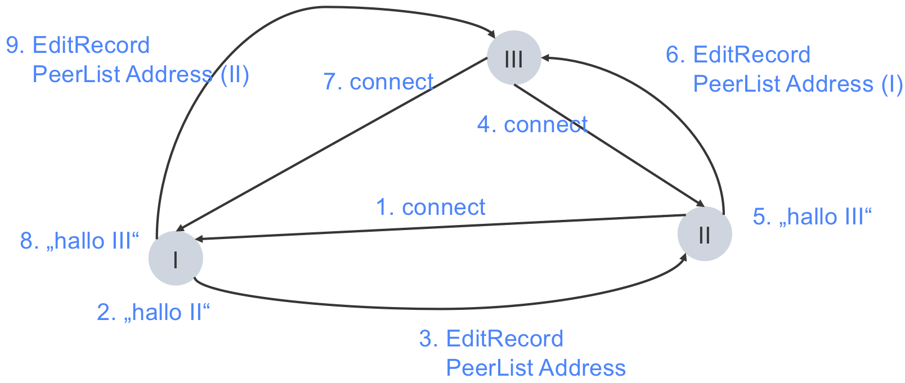
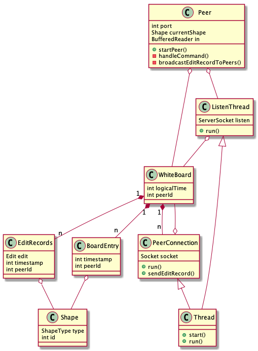
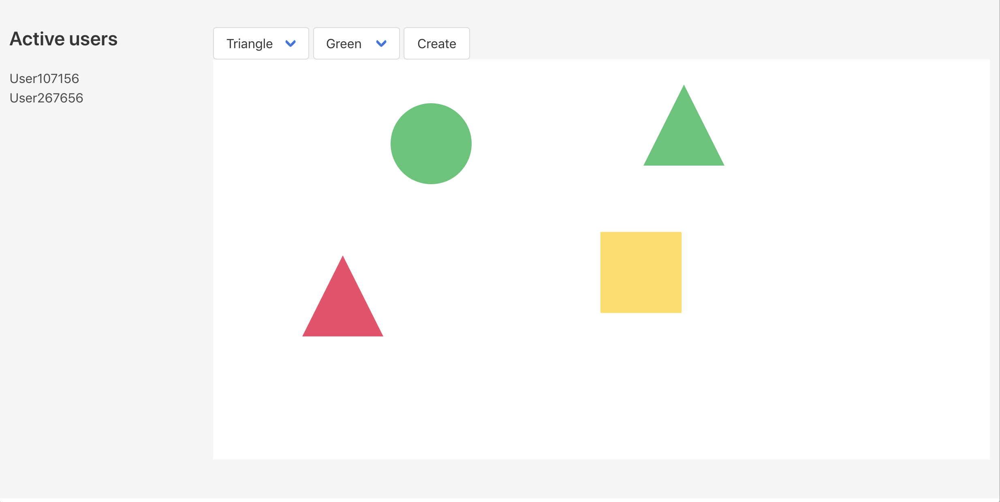

# WhiteBoard-Implementation-Examples
Examples of WhiteBoard Implementations using different architectural styles: PRC RMI P2P Cloud and Web. 1 - 5 with Java and 6, 7 with JavaScript and NodeJS.
## Requirements
   java: [openJDK 13.0.2 build 13.0.2+8](https://jdk.java.net/14/) or greater  
   nodeJS: [v14.4.0](https://nodejs.org/en/)   
   npm: [6.14.4](https://www.npmjs.com/)   

## Table of Contents
1. [EchoExample](#1-EchoExample)
1. [RPC](#21-RPC-Example-Simple)    1. [RPC Example Simple](#21-RPC-Example-Simple)     2. [RPC Example](#22-RPC-Example)
1. [RMI Example](#3-RMI-Example)
1. [P2P Example](#4-P2P-Example)
1. [Cloud AWS Example](#5-AWS-Cloud-Example)
1. [Simple UI](#6-Simple-UI)
1. [WebExample](#7-WebExample)

## 1. [EchoExample](EchoExample)
* **TCP**: 
    + **Client**: Connects to the Server, sends the input from *stdin* and prints the echo responds.
    + **EchoServer**: Handling one client at a time on port `12345` and sends back the echo changing "i" to "o".
    + **EchoServerExtended**: Is of the same functionality as *EchoServer*, but handles multiple clients concurrently. 
    + *compile*: `javac -d bin -cp src src/tcp/*.java`
    + *run*:        
        `java tcp.EchoServer` or `java tcp.EchoServerExtended`      
        `java tcp.Client`   
    
* **UDP**: 
  + **UDPClient**: Is sending *one* input from *stdin* as a datagram packet to the *UDPServer* and prints its responds.
  + **UDPServer**: Receives datagram packets on port `9876` und echoes them back to the client. 
  + *compile*: `javac -d bin -cp src src/udp/*.java`
  + *run*:  
    `java udp.UDPServer`      
    `java udp.UDPClient`    

## 2.1 [RPC Example Simple](RPCExampleSimple)

Please note: The RPC example is more an "without RMI" example. It is realized in order to show you the difference between with and without RMI.

* **RPC Simple Server**: Handling only one client at a time and has the same service as the *RPC Server*.
* **Client**: Same as *2.1 RPC Client*
* *compile*: `javac -d bin -cp src src/rpc/*.java`
* *run*:     
    `java rpc.SimpleServer`     
    `java rpc.Client` 

## 2.2 [RPC Example](RPCExample)

Please note: The RPC example is more an "without RMI" example. It is realized in order to show you the difference between with and without RMI.

* **Server**: Handling multiple clients in Threads and executing changes on the Whiteboard. 
* **Client**: Connects to the server, sending commands the Whiteboard service. For each message to the server, the client awaits a response.
Command **stop**: The client shuts down and the connection closes. 
The principal commands are: *create*, *put*, *get*, and *delete*. 
Other commands are interactively described by the Whiteboard service.
* *compile*: `javac -d bin -cp src src/rpc/*.java`
* *run*:        
    `java rpc.Server`       
    `java rpc.Client`        

## 3. [RMI Example](RMIExample)
* **RMI Server**: Provides the WhiteBoard class as an Interface.
Start the registry first in the `bin` directory (or the same as you start the server)
* **RMI Client**: Handles commands and executes them via the Whiteboard remote Interface. The interaction is the same as for the RPC example with the principal commands: *create*, *put*, *get*, and *delete*. 
* *consists of 3 packages*: 
  + rmiserver: 
  + rmiinterface: 
  + rmiclient:
* *compile*: `javac -d bin -cp src src/*/*.java` or with you IDE relying on the *.classpath* file
* *run*:        
    `java rmiserver.WhiteBoardService`    
    `java rmicient.Client`      
  
## 4. [P2P Example](P2PExample)
This example implements the Whiteboard application in a pure Peer2Peer architactural style that relies on a complete network of *TCP* connections. 

* **Peer**: First, start one Peer with its port (1 var). Then, start all other peers with their port, their hostname and the port of a known peer in the network (3 vars). 
    * *compile*: `javac -d bin -cp src src/*.java` or with you IDE relying on the *.classpath* file (or in Eclipse "run as configuration")
    * *run*:        
    `java p2p.Peer 12345`    
    `java p2p.Peer 12344 localhost 12345`   
    `java p2p.Peer 12343 localhost 12344` ...

An **Edit** is defined as a: `enum Edit { add, remove }`. Each edit on the Whiteboard is "broadcasted" to all others.
An **EditRecord** contains the Edit, Shape, Peer ID, and has a logical time-stamp. Every Peer records a sorted array of all EditRecords to generate a consistent state of the Whiteboard across Peers. 
The **Whiteboard** class is the shared instance between the different Threads, where the data about the Peer2Peer network and the Whiteboard itself is stored. 
The **PeerConnection** class takes care of all communication on one socket connected to one Peer and is running a thread to receive broadcasted EditRecords. 
The **ListingThread** waits for new Peers to join the network and establishes PeerConnections, which then send the needed information, namely the Addresses of all Peer in the Network and the EditRecords. 

If one Peer disconnects, all others update their List of PeerConnections. The input interaction is the same as in the previous examples. With the *stop* keyword the Peer leaves the network. 

* Protocol choices *TCP* vs. *UDP*: This implementation relies on stable TCP connnections. For increasing size of the network it might result in larger bandwith usage and overhead. In this case *UDP* could be a better choice, though possible packege los needs to be handled, to assure a consistent Whiteborad.

## 5. [AWS Cloud Example](AWSCloudExample)
The Amazon Elastic Compute Cloud (EC2) offers the following advantages:
+ High availability for different geo-locations (availability zones)
+ Autoscalling to maintain the application availability by adding or removing EC2 instances, depending on demand, e.g. CPU-usage.
+ Elastic Load Balancer (ELB) to distribute the incoming traffic equally among EC2 instances. 
+ Performs health checks to terminate and restart erroneous instances. 

### Setup of our RPC-Server on the AWS-Cloud
[more detailed setup here!](https://medium.com/serverlessguru/creating-an-aws-ec2-instance-d5cf332fdb0c)
1. Launch EC2 Instance (Amazon Linux 2 AMI) Instance type: *t2.micro* (**free**)
2. Connect to the instance with ssh and do the desired setup, so we install JAVA and pull from this git Repository.
3. Create an Amazon Machine Images (AMI) from the Instance
4. (**not free**) [Create and Launch an **Autoscaling Configuration Group**](https://docs.aws.amazon.com/autoscaling/ec2/userguide/GettingStartedTutorial.html) with our AMI. Then we choose a desired capacity one 1 Instance, minimum 1 and maximum 
5. When an instance terminates, a new one will be started to reach the desired Capacity. We configured scaling policy to increase and decrease the number of instances depending on the average CPU-Utilization. Decrease if it is below 20%, and increase by one if it is above 30% for demonstration purpose. 
6. (**not free**) [Add a **Load Balancer**](https://docs.aws.amazon.com/elasticloadbalancing/latest/classic/elb-getting-started.html) to the Auto-Scaling Group, that performs health checks on the instances and distributes the traffic.

7. Now we have a scalable Whiteboard-Service, but each Server-Instance has its Whiteboard, as they are not synchronized. A database would provide a solution to guarantee a consistent state, e.g. accessing an Amazon Elastic Block Store (EBS) from all instances.

For interaction and testing of the cloud use:
+ RPCExample:   
    `java rpc.Client RPC-load-balancer-205ffa34ea80b9cb.elb.us-east-2.amazonaws.com`   
+ AWSCloudExample:      
    `java aws.Client RPC-load-balancer-205ffa34ea80b9cb.elb.us-east-2.amazonaws.com <number of threads>` 

### aws.Client:
Creates multiple Client-Threads to connect to the server and create Shapes on the Whiteboard in a while-loop, to test the server, whit 40 Threads the CPU is quickly above 30%. 

## 6. [Simple UI](SimpleUI)
Contains an `index.html` file, that can be opened in any browser, CSS-styles `ccc/styles.css` where the shape classes are defined, and javascript `js/scripts.js` that creates and deletes HTML-elements. 
The JavaScript Code builds the shapes inside the HTML-document, recordes them in an array and saves the array in the browsers [Local Storage](https://developer.mozilla.org/en-US/docs/Web/API/Window/localStorage) before unloading the page. So that the previous state is recreated upon browser reloads.
The creation of shapes is triggered by *onclick*-events of the corresponding button. The deletion of a shape is triggered by an *onclick*-event on the shape itself.
The browsers Local Storage can be inspected in its Web Developer > inspect Storage > Local Storage > *url*. 

## 7. [WebExample](WebExample)
The Whiteboard implementation uses the [express](https://www.npmjs.com/package/express) module on the server-side in the `index.js`, to create a file-server that distributes the static file to its clients from the `/public` folder. To have a consistent state of the Whiteboard across clients the server establishes socket connections and broadcasts all changes on the whiteboard. To transmit messages over the WebSocket-protocol we use the module [socket.io](https://www.npmjs.com/package/socket.io) which takes care of the handshake upon connection and the underlying protocol, so that we can easily define new types of socket messages and how they are handled. 
The Server is the unique place of truth, recording the state of the whiteboard. The changes on the client's HTML-document, displaying the state of the whiteboard, are triggered by the server's socket messages.

The *express server* **app** listens on port 5000 and handles the following socket messages:   
    `"connection", "disconnect", "create shape", "create shape", "move shape"`    
The server holds a set of *activeUsers*, an array of *shapes* of the whiteboard and an *idCounter* for shapes.

The *Clients* handle and emit:          
    `"whiteboard", "new user", "user disconnected", "create shape", "delete shape", "move shape", "refresh"`   
The username is saved in the Local Storage across browser restarts.

**Moving shapes**:   
   Shapes have a position *x,y*. The function *handleDragStart* is called on shapes for the "onmousedown" event. A new event listener is added *mousemove* to render the shape at the cursor's position. *onmouseup* the client emits the *move shape* massage to the server with the new position and removes the *mousemove* eventlistener. 

For the UI design and CSS-styling we use [bulma](https://bulma.io/) that has designed and responsive components. In the `/sass` folder we import the [bulma](https://bulma.io/) classes and define additional styles, such as the hover behavior for the delete button. 

On the client-side, after a socket connection with the server is established, the client sends its username. The username is saved in the client's Local Storage and that was before randomly generated. The Server recodes only the usernames of users that have an active connection. If we would upgrade the application with a user-login, so that the users can connect to their accounts from any device, the user-information would have to move to a database on the server-side.

To test the Whiteboard Web-Application, first install the npm package-manager and nodeJS:     
For Linux-Systems:  
    `sudo apt install nodejs`    
    `sudo apt install npm`  

For MacOSX, use [homebrew](https://brew.sh/) for installing the packages. Please install [nvm](https://github.com/nvm-sh/nvm), a version manager for node.js, first. Then `nvm install 14.4.0`. Switch then in the project folder ([local copy of github repo]((WebExample))):

Install dependencies:
    `npm install`   
Create the CSS-files:
    `npm run css-build` 

Simply run the server with:     
    `npm run start`

Checkout the Whiteboard at http://localhost:5000/ and often different windows and broswers with private mode. Happy clicking! 

